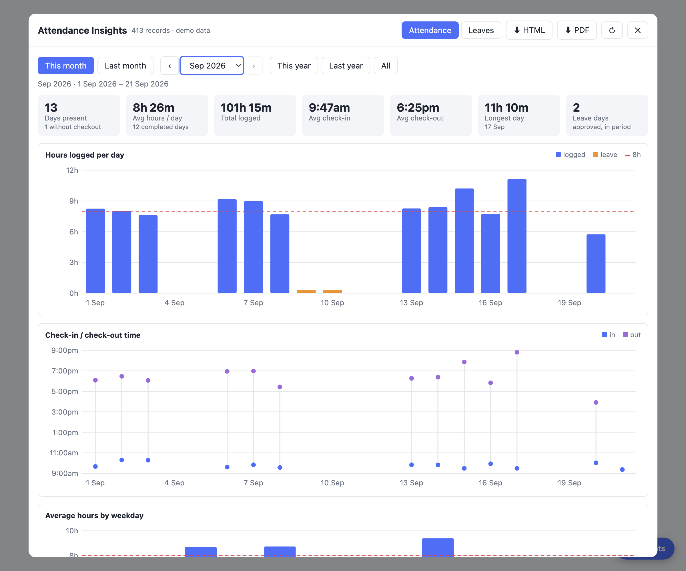
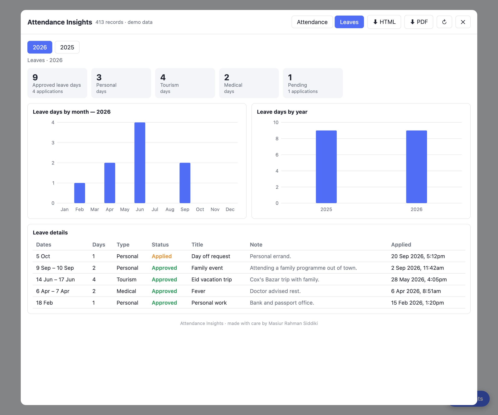

# AuthLab Attendance Insights

Chrome / Firefox extension that adds an **📊 Insights** panel to `lounge.authlab.io/office` — graphs and details for your own attendance and leaves, built from data the page's API already returns but doesn't display.

## Screenshots

*(demo data)*

## Features

- **Calendar periods** — this month (1st → today), last month, any month, this/last year, all time
- **Attendance** — days present, average hours, average check-in/out, hours per day (8h reference line, leave days marked), check-in/out times, weekday and monthly averages, daily table with work notes
- **Leaves** — approved days by type, by month and by year, pending applications, full details with note and exact applied time
- **Export** — standalone HTML report, or PDF via the print dialog
- Follows the site's light/dark mode

## Install

1. Clone or download this repo
2. Open `chrome://extensions` and enable **Developer mode**
3. **Load unpacked** → select this folder
4. Open `https://lounge.authlab.io/office` and click **📊 Insights** (bottom-right)

Requires Chrome 111+.

### Firefox (128+)

Temporary (removed when Firefox closes): open `about:debugging#/runtime/this-firefox` → **Load Temporary Add-on…** → select `manifest.json`.

Permanent: Firefox only installs signed add-ons. Sign it as *unlisted* on [addons.mozilla.org](https://addons.mozilla.org/developers/) (or `npx web-ext sign --channel unlisted`) and share the resulting `.xpi`.

## Privacy

Read-only. It calls the same endpoints the page itself uses (`attendance/my-attendances`, `hr/leaves`) with your existing session, on each open. Nothing is stored, and nothing is sent anywhere else. No permissions are requested beyond running on the `/office` page.

## Author

Masiur Rahman Siddiki
